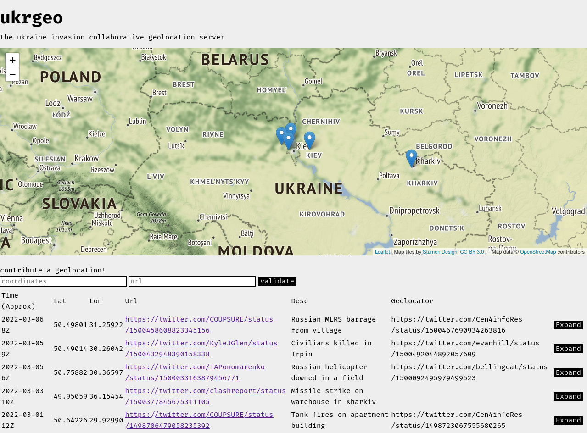

# ukrgeo

A collaborative geolocation server for the Ukraine conflict written in Vue + Typescript and Rust on the backend. Currently you can add provisionally add geolocations to the database, but the server uses a cookie to only show unverified geolocations to the person who submitted them.

Next steps

- Moderation queue
- Nicer mouse tooltips

[Demo instance](https://ukrgeo.x.charliegillespie.com)